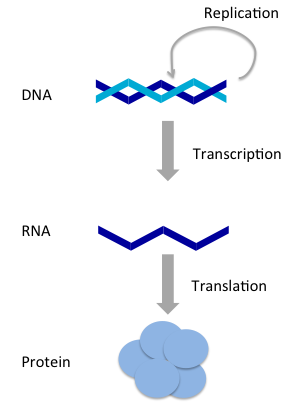

$$\def\absarg#1{\left|#1\right|}$$
$$\def\Earg#1{\mathbf{E}\left[#1\right]}$$
$$\def\reals{\mathbb{R}} % Real number symbol$$
$$\def\integers{\mathbb{Z}} % Integer symbol$$
$$\def\*#1{\mathbf{#1}}$$
$$\def\m#1{\boldsymbol{#1}}$$
$$\def\FDR{\widehat{\operatorname{FDR}}}$$
$$\def\Gsn{\mathcal{N}}$$
$$\def\Unif{\operatorname{Unif}}$$
$$\def\Bern{\operatorname{Bern}}$$

---

# STAT 992: Selective Inference in Computational Genomics

## Spring 2024

```{r setup, include=FALSE}
library(tidyverse)
library(knitr)
opts_chunk$set(
  echo = TRUE,
  message = FALSE,
  warning = FALSE,
  cache = TRUE,
  dpi = 200,
  fig.align = "center",
  out.width = 650,
  fig.height = 3,
  fig.width = 9
  )
```

---

### Welcome!

---

### Discuss

* Review Syllabus
* Introductions
  - Degree program
  - Fun fact
* Areas of shared interest?
  - What areas do you have the most experience in?
  - What areas would you like to develop more in?
  
---

## Why Selective Inference?

---

### Replicability

For scientific progress, it's important that published results can be replicated
by many independent research groups. Lately, the failure to replicate, has drawn
substantial attention, both within and beyond academia.

.pull-left[
* [The Truth Wears Off](https://www.newyorker.com/magazine/2010/12/13/the-truth-wears-off)
* [Why Do So Many Studies Fail to Replicate?](https://www.nytimes.com/2016/05/29/opinion/sunday/why-do-so-many-studies-fail-to-replicate.html)
* [Estimating the Reproducibility of Psychological Science](https://www.science.org/doi/10.1126/science.aac4716)
]

.pull-right[

]

---

### Scientific Response

.pull-left[
* National Academies Report: [Reproducibility and Replicability in Science](https://nap.nationalacademies.org/read/25303/chapter/3)
* NSF: [Dear Colleague Letter: Reproducibility and Replicability in Science](https://www.nsf.gov/pubs/2023/nsf23018/nsf23018.jsp)
* Nature Commentary: [US funders must do more to ensure research reliability](https://www.nature.com/articles/d41586-023-00361-1)
]

.pull-right[

]

---

.pull-left[The more hypotheses we test, the higher the chance we observe interesting patterns just by chance.]

.pull-right[
<a href="https://imgs.xkcd.com/comics/significant.png">

</a>
]

---

### Replication in Biology

Biology has undergone a rapid process of mechanization.
["Statistical significance for genomewide studies"](https://www.pnas.org/doi/10.1073/pnas.1530509100) was the watershed paper.

.center[

]

Figure from Yoav Benjamini's lecture on ["Selective Inference: The Silent Killer
of Reproducibility."](https://www.youtube.com/watch?v=6ZxIzVjV1DE)

---

## Computational Genomics Crash Course

---

### Central Dogma

.pull-left[
DNA is like the "musical score" from which all cellular machinery is derived.

RNA transcripts are the intermediaries between DNA and Protein.

Proteins are the components from which larger cellular structures can be
assembled.
]

.pull-right[

]

---


From Mukherjee's "The Song of the Cell." Read more of the excerpt at [this
link](https://drive.google.com/file/d/1jVACAaVcbirD9lgfv3EewVJhHObpB3en/view?usp=sharing).

---

### Variation

Variation in the genome result in variation in the observed cells, tissues, and
(ultimately) organisms. Mapping this variation is a central goal of biology.

.center[

]
Figure from ["New Cell Atlases Reveal Untold Variety in the Brain and Beyond"](https://www.quantamagazine.org/new-cell-atlases-reveal-untold-variety-in-the-brain-and-beyond-20231213/)

---

### Variation

Variation in the genome result in variation in the observed cells, tissues, and
(ultimately) organisms. Mapping this variation is a central goal of biology.

.center[

]
Figure from ["New Cell Atlases Reveal Untold Variety in the Brain and Beyond"](https://www.quantamagazine.org/new-cell-atlases-reveal-untold-variety-in-the-brain-and-beyond-20231213/)

---

### Variation

Variation in the genome result in variation in the observed cells, tissues, and
(ultimately) organisms. Mapping this variation is a central goal of biology.

.center[


Figure from ["Cancer Genome Landscapes"](https://www.science.org/doi/10.1126/science.1235122).
]

---

### Single-Cell Sequencing

All cells have the same genetic code. They look so different because they
express different subsets of genes to different degrees.

.center[

]

---

### Spatial Transcriptomics

Not only can we measure cell-level gene expression, we can spatially localize
each cell.

.center[

]

---

### Single-Cell Microbiomics

It's even possible to profile gene expression within microbial cells.

.center[

]

---

### CRISPR-based Screens

Using CRISPR, we can understand how genes are related to one another, helping us
identify the "genetic programs" underlying health and disease.

.center[

]

---

## Introduction to Large Scale Inference

---

### Large Scale Inference

Notation
  * Hypotheses of interest: $H_{1}, \dots, H_{M}$. Some of them are non-null, but you don't know which.
  * Associated $p$-values: $p_{1}, \dots, p_{M}$.

Goal: Reject as many non-null hypotheses as possible while controlling the _False Discovery Rate_,

\begin{align*}
\text{FDR} := \Earg{\frac{\absarg{\text{False Positives}}}{\absarg{\text{Rejections}}\vee 1}}
\end{align*}

---

### Examples

.pull-left[
* Microbiome: Is taxon $m$ associated with the development of autism in infants?
* Epigenetics: Is CpG site $m$ differentially methlyated among smokers?
* Cancer: Is elevated immune cell expression of gene $m$ associated with improved survival rates?
]

.pull-right[

]

---

### $p$-value histogram

* Under the null, the $p$-values follow a uniform distribution. 
* The spike near 0 $\implies$ true alternative hypotheses
* $\pi_{0}$ refers to the true proportion of nulls

.center[
  
]

---

### $p$-value histogram

* Under the null, the $p$-values follow a uniform distribution. 
* The spike near 0 $\implies$ true alternative hypotheses
* $\pi_{0}$ refers to the true proportion of nulls

.center[
  
]

---

### $p$-value histogram

* Under the null, the $p$-values follow a uniform distribution. 
* The spike near 0 $\implies$ true alternative hypotheses
* $\pi_{0}$ refers to the true proportion of nulls

.center[
  
]

---

### Benjamini-Hochberg

The Benjamini-Hochberg (BH) procedure controls the FDR at
level $q$.

1. Sort the $p$-values: $p_{(1)} \leq p_{(2)} \leq \dots \leq p_{(M)}$
1. Find the largest $i$ such that $p_{(i)} \leq \frac{i q}{M}$
1. Reject hypotheses associated with $p_{(1)} \leq \dots \leq p_{(i)}$ 

---

### Why?

At any threshold $t$, estimate the FDR using relative areas from the null and alternative densities.

.center[

]

---

### Why?

At any threshold $t$, estimate the FDR using relative areas from the null and alternative densities.

.center[

]

---

### Why?

Let $R\left(t\right)$ be the number of rejected hypotheses at threshold $t$. Then,

.pull-left[
\begin{align*}
\FDR\left(t\right) &= \frac{\pi_{0}Mt}{R\left(t\right)}
\end{align*}
]

.pull-right[

]

---

### Why?

Maximize the number of rejections while limiting false discoveries.

.pull-left[
Optimize:
\begin{align*}
\text{maximize } &R\left(t\right) \\
\text{subject to } &\FDR\left(t\right) \leq q
\end{align*}
]

.pull-right[

]

---

### Why?

Maximize the number of rejections while limiting false discoveries.

.pull-left[
Optimize:
\begin{align*}
\text{maximize } &t \\
\text{subject to } &\FDR\left(t\right) \leq q
\end{align*}
]

.pull-right[

]

---

### Why?

Larger thresholds let more hypotheses through.

.pull-left[
Optimize:
\begin{align*}
\text{maximize } & t \\
\text{subject to } &\FDR\left(t\right) \leq q
\end{align*}
]

.pull-right[

]

---

### Why?

Larger thresholds let more hypotheses through.

.pull-left[
Optimize:
\begin{align*}
\text{maximize } & t \\
\text{subject to } &\FDR\left(t\right) \leq q
\end{align*}
]

.pull-right[

]

---

### Why?

Larger thresholds let more hypotheses through.

.pull-left[
Optimize:
\begin{align*}
\text{maximize } &t \\
\text{subject to } &\FDR\left(t\right) \leq q
\end{align*}
]

.pull-right[

]

---

### Why?

Look for the largest $p$-value satisfying this inequality.

.pull-left[
Optimize:
\begin{align*}
\text{maximize } &t \\
\text{subject to } &\FDR\left(t\right) \leq q
\end{align*}
]

.pull-right[
If we substitute $t = p_{(i)}$, then

\begin{align*}
&\frac{\pi_{0}M p_{(i)}}{i} \leq q \\
\implies & p_{(i)} \leq \frac{i q}{\pi_{0} M} \\
\implies & p_{(i)} \leq \frac{i q}{M}
\end{align*}
]
